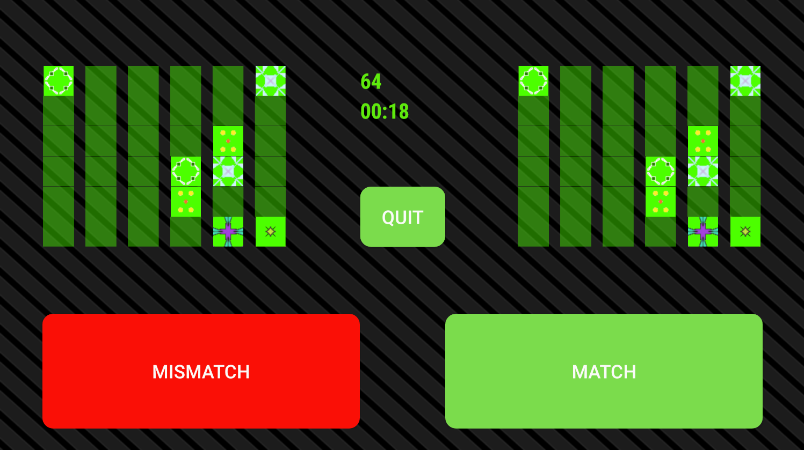

# shape-match-android

Screenshot of the main game screen 

 

The goals of the game is to compare the grid of shapes on the left with the one on right and press match if the shapes match in both grid or mismatch otherwise. 

Each round is limited to 1.5 minute. Wrong answer would result in points deducted. 

Your last 40 games stat can be viewed in a graph. 

 
